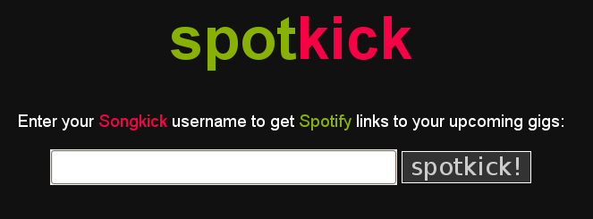

 ## Update (2019)

I wrote this post in 2010, and this project won't work anymore.

---

Recently, I have been consuming a lot of music through <a href="http://spotify.com" target="_new">Spotify</a>, a desktop application that gives you instant access to millions of songs.  As well as listening to music
 at home, I try to go to as many live gigs as possible.  Living in <a href="http://www.songkick.com/metro_areas/24426-uk-london/calendar" target="_new">London</a>, there are so many touring bands to chose from that it is sometimes difficu
lt to keep track.  For the last year or so, I have been helped by <a href="http://songkick.com" target="_new">Songkick.com</a>, a fantastic online database and community for live music fans.  Through the site, you can track your favourite
 artists, receive email notifications when they are playing near you, and mark any gigs you are going to (which in turn gets fed into my <a href="http://calendar.google.com" target="_new">Google Calendar</a> so I don't forget).  When I go
 to a gig, I like to listen to the music of the performer beforehand, which I usually do using Spotify.  I find, however, that I frequently forget to do this, and end up not enjoying the gig as much.

To help me keep up to date, I decided to put together a little app to generate Spotify artist links from my Songkick gig calendar.  Thanks to Spotify's relatively new <a href="http://developer.spotify.com/en/metadata-api/overview/" target
="_new">Metadata API</a>, <a href="http://philnash.co.uk/" target="_new">Phil Nash</a>'s <a href="github.com/philnash/meta-spotify" target="_new">meta-spotify</a> ruby wrapper,  and a little bit of
<a href="http://www.sinatrarb.com" target="new">Sinatra</a>, <a href="http://wiki.github.com/hpricot/hpricot/" target="new">Hpricot</a> and <a href="http://haml-lang.com/" target="new">Haml</a>, this was pretty simple.

<strike>You can see the result by clicking on the image:</strike>

 
If you want to have a look at the source, it's on <a href="http://github.com/andrewmcdonough/spotkick" target="new">my github</a>
