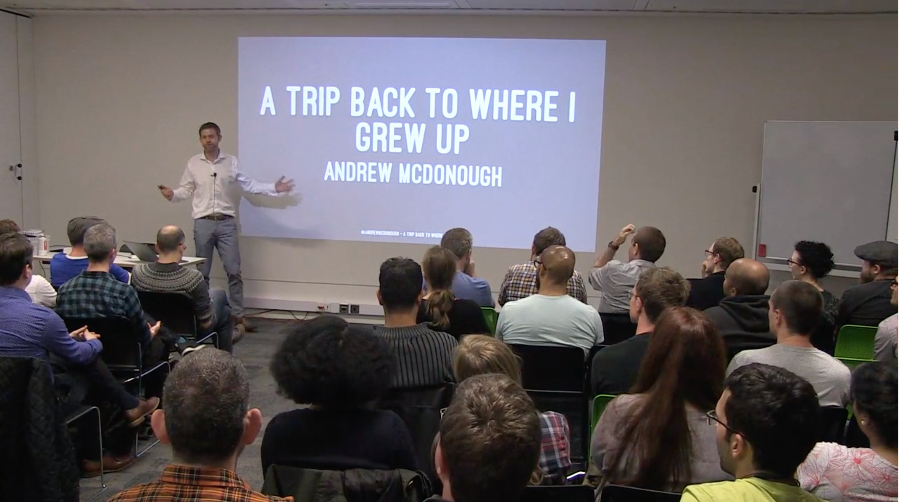

On 11th September 2017, I spoke at the [London Ruby Users Group](https://lrug.org) about the modern Java ecosystem. I had left the Java world around a decade before, and had bad memories of writing lots of verbose boilerplate code. When I moved to being a Ruby developer, I left all of this behind, and never thought I'd go back. On a recent project, however, I was exposed to modern Java, which now has lambdas, and lots of nice syntactic sugar. On top of that, the Spring framework and the accompanying ecosystem had lots of the features I had been looking for when considering moving to a microservices architeture.

* [Slides](./a-trip-back.pdf)
* [Video](https://skillsmatter.com/skillscasts/10855-a-trip-back-to-where-i-grew-up)
