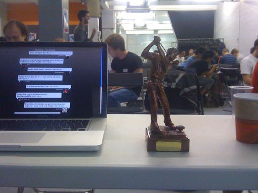
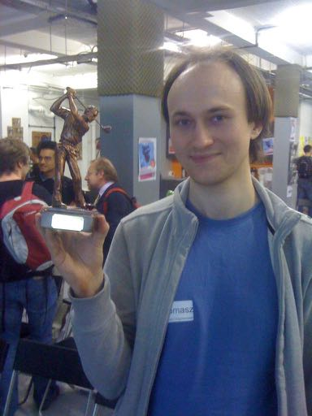

On 9th May 2011, I ran a coding competition at the [London Ruby Users Group](https://lrug.org). People were asked to form teams of 4-8 people, and solve nine short ruby golf 'holes' using as few characters as possible. Each hole was defined by [a set of RSpec examples](https://github.com/andrewmcdonough/rubygolf) describing a single method, and the teams had to write the method to pass all of the examples. The team with all tests passing using the fewest number of charaters would be declared the winner.

I made a trophy for the competition by ordering a golf trophy, sawing off the golf ball with a hacksaw, and replacing it with a Ruby I bought on eBay.

The winner of the competition was a team of one person working on his own - [Tomasz Wegrzanowski](https://twitter.com/t_a_w).

Our lovely hosts Skills Matter took some [photos of the evening](https://www.flickr.com/photos/skillsmatter/albums/72157626683669388).

Thanks to [Simon Coffey](https://twitter.com/urbanautomaton) for his help writing some of the challenges.

### Links
 * LRUG: http://lrug.org/meetings/2011/#may-2011-meeting
 * Skills matter: https://skillsmatter.com/meetups/1000-ruby-golf
 * Photos: https://www.flickr.com/photos/skillsmatter/albums/72157626683669388
 * GitHub: https://github.com/andrewmcdonough/rubygolf
