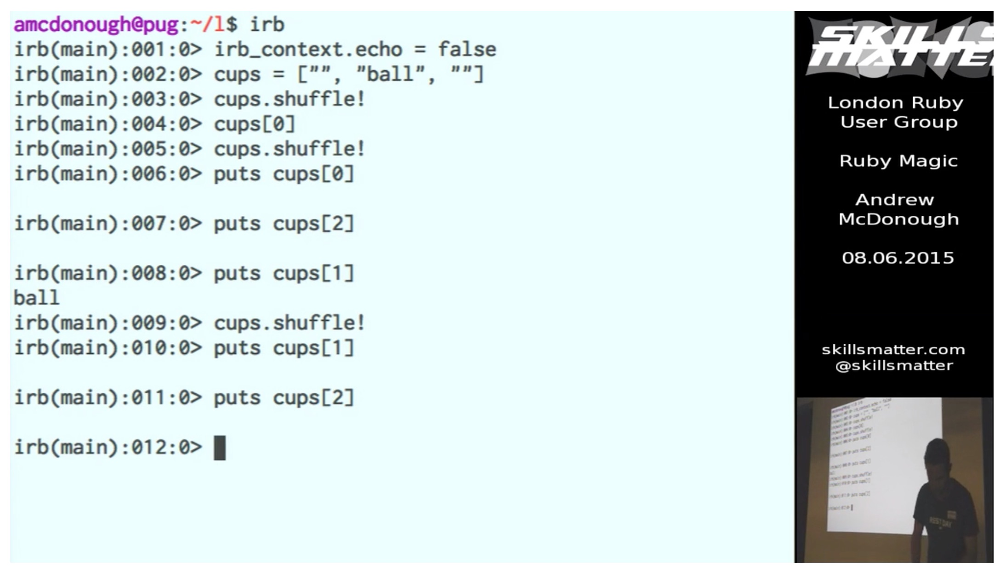

On 8th June 2015 I gave a talk to the [London Ruby Users Group](https://lrug.org) entitled *Ruby Magic*.  For this talk, I recreated several popular magic tricks in Ruby, including [cups and balls](https://en.wikipedia.org/wiki/Cups_and_balls), turning water into wine, and [sawing a person in half](https://en.wikipedia.org/wiki/Sawing_a_woman_in_half).

I then told the audience how the tricks were done, by including a [gem](https://github.com/andrewmcdonough/magic_set) I wrote in my `.irbrc` file. This magic_set gem monkey patches core Ruby classes like `String` and `Array`. The purpose of this talk was to demonstrate some of the unexpected behaviour you can get if you extend classes Ruby's core classes, something I strongly advise against.

* Video: https://skillsmatter.com/skillscasts/6455-ruby-magic
* Magic set: https://github.com/andrewmcdonough/magic_set
